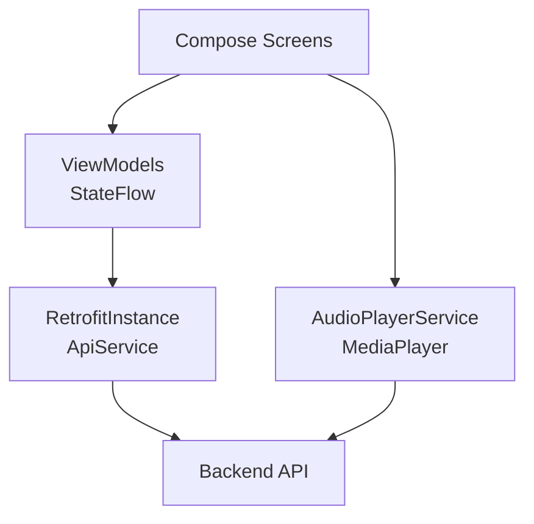
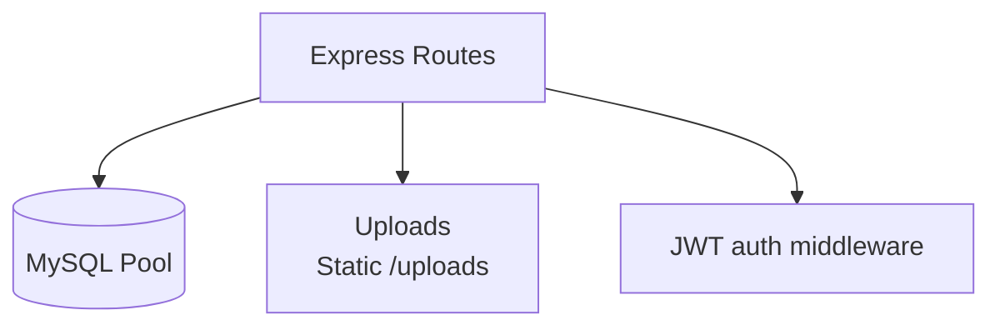
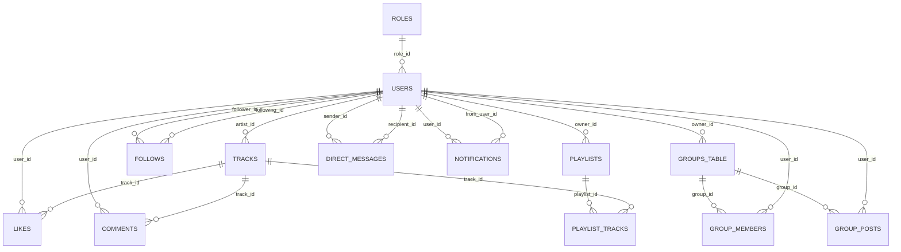

# FlerkthSound

FlerkthSound — мобильное приложение (Android) и backend-сервер для музыкальной социальной сети: публикация треков, лайки, комментарии, подписки, плейлисты, чаты/группы, уведомления и админ‑панель.

## Возможности

- **Музыка:** загрузка треков, лента, поиск, проигрывание.
- **Социальное:** лайки, комментарии, подписки.
- **Плейлисты:** создание плейлистов и просмотр плейлистов пользователя.
- **Сообщения:** личные сообщения и чаты.
- **Группы:** группы и посты в группах.
- **Уведомления:** системные и админ‑уведомления.
- **Админ‑панель:** управление пользователями/контентом/настройками.

---

# Запуск проекта

Ниже инструкция для локального запуска (Windows).

## Требования

- **Android Studio** (для сборки/запуска приложения)
- **JDK** (обычно ставится вместе с Android Studio)
- **Node.js 18+**
- **MySQL 8+**

## 1) Подготовить базу данных (MySQL)

1. Создай базу `FApp`.
2. Импортируй дамп:

- `flerkthsound-backend/FApp.sql`

Это создаст таблицы, индексы, триггеры и базовые данные.

## 2) Запуск backend

Проект backend находится в папке `flerkthsound-backend`.

1. Установи зависимости:

```bash
npm install
```

2. Запусти сервер:

```bash
npm run dev
# или
npm start
```

По умолчанию сервер стартует на:

- `http://localhost:3000/api`

Backend также раздает статические файлы по пути:

- `http://localhost:3000/uploads/...`

## 3) Настроить адрес backend для Android

В приложении baseUrl выбирается автоматически:

- **Эмулятор:** `http://10.0.2.2:3000/api/`
- **Физическое устройство:** `RetrofitInstance.BASE_URL_PHYSICAL_DEVICE`

Файл:

- `app/src/main/java/com/example/flerkthsound/network/RetrofitInstance.kt`

Чтобы приложение на телефоне видело твой backend, **замени** `BASE_URL_PHYSICAL_DEVICE` на IP компьютера в Wi‑Fi сети:

```kotlin
private const val BASE_URL_PHYSICAL_DEVICE = "http://<YOUR_PC_IP>:3000/api/"
```

Проверка IP (Windows):

```bash
ipconfig
```

## 4) Запуск Android приложения

1. Открой проект в Android Studio.
2. Выбери устройство (эмулятор или телефон).
3. Нажми **Run**.

---

# Структура проекта

```text
FlerkthSound/
  app/                          # Android-приложение (Kotlin, Jetpack Compose)
    src/main/java/...           # UI/VM/Network/Player
    src/main/res/               # ресурсы, иконка, xml
  flerkthsound-backend/         # Node.js/Express backend
    server.js                   # основной сервер/роуты
    migrations/                 # SQL миграции
    FApp.sql                    # дамп базы
    uploads/                    # медиа-файлы (audio/images/avatars)
```

## Android (app)

Ключевые пакеты:

- `ui/` — экраны и компоненты (Jetpack Compose)
- `viewmodels/` — ViewModel (StateFlow)
- `network/` — Retrofit API, модели
- `player/` — воспроизведение аудио (MediaPlayer/foreground service)
- `utils/` — токены/тема/утилиты

## Backend (flerkthsound-backend)

- `server.js` — Express API, JWT auth, работа с MySQL
- `migrations/` — SQL для доработок схемы
- `uploads/` — папки для загружаемых медиа

---

# Архитектура

## Высокоуровневая схема

```mermaid
flowchart LR
  A[Android App\nJetpack Compose] -->|HTTP JSON (Retrofit)| B[Node.js/Express API]
  B -->|SQL| C[(MySQL: FApp)]
  B --> D[File storage\n/uploads]
  A -->|stream/play URL| D
```

## Android (упрощенно)



## Backend (упрощенно)



---

# База данных (MySQL)

Источник схемы: `flerkthsound-backend/FApp.sql`.

## Основные таблицы

- `users` — пользователи
- `roles` — роли (GUEST/USER/MODERATOR/ADMIN)
- `tracks` — треки
- `likes` — лайки треков
- `comments` — комментарии
- `playlists`, `playlist_tracks` — плейлисты и связь с треками
- `follows` — подписки
- `groups_table`, `group_members`, `group_posts` — группы
- `direct_messages` — личные сообщения
- `notifications` — уведомления

## ER-диаграмма (упрощенная)



## Триггеры

В `FApp.sql` есть триггеры для счетчиков:

- `tracks.likes_count`, `tracks.comments_count`
- `playlists.track_count`
- `users.followers_count`, `users.following_count`
- `groups_table.members_count`

---

# Примечания

## Камера / загрузка фото

В приложении используется `FileProvider`:

- `AndroidManifest.xml` добавлен provider `${applicationId}.fileprovider`
- `app/src/main/res/xml/file_paths.xml` определяет доступ к `cache/` и `files/`

Это нужно для работы `ActivityResultContracts.TakePicture()`.

## Настройки модерации (запрещенные слова)

Backend хранит настройки в:

- `flerkthsound-backend/admin_settings.json`

И применяет список `bannedWords` для проверки текста (комментарии/сообщения/посты).
